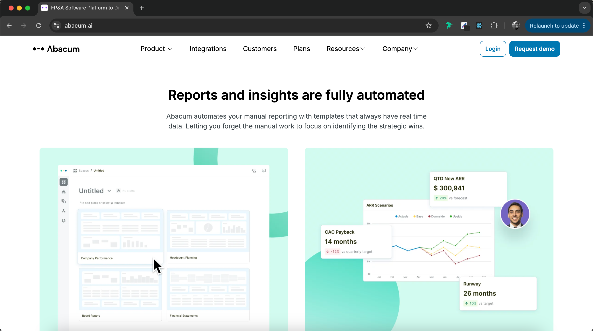

# Abacum  
🎯 This project is a static **markup implementation** of the [Abacum](https://www.abacum.ai/) main page using **Pug** (for HTML templating) and **TailwindCSS** (for styling). The goal was to create a structured, maintainable, and scalable frontend using modern tools  
 
## 🚀 Tech Stack  
    
 
## 📸 Demo  
  
 
## 🛠️ Features  
✅ Pug-powered templating – Clean, modular, and reusable markup  
✅ TailwindCSS integration – Utility-first styling for rapid development  
✅ Build & Watch modes – Easily compile templates and styles  

## 🔗 Live Demo  
Not available since the design was recently changed

## 👤 Author  
Oleksandra Masiukevych - [LinkedIn](https://www.linkedin.com/in/omasiukevych)

